# Chat Interface Design for Leaderboard Generator

This document outlines the comprehensive design for a chat interface that enhances the leaderboard-generator tool by providing an LLM-powered conversational experience. The chat interface will make leaderboard creation more accessible, faster, and guided through natural language interaction.

## Table of Contents

1. [Introduction](#introduction)
2. [Existing Architecture Analysis](#existing-architecture-analysis)
3. [System Architecture](#system-architecture)
4. [LLM Integration Strategy](#llm-integration-strategy)
5. [Conversation Flow and User Experience](#conversation-flow-and-user-experience)
6. [Frontend Interface Components](#frontend-interface-components)
7. [Backend API and Services](#backend-api-and-services)
8. [Data Flow Diagrams](#data-flow-diagrams)
9. [Deployment Options](#deployment-options)
10. [Development Phases and Milestones](#development-phases-and-milestones)

## Introduction

The leaderboard-generator tool currently automates the creation of new leaderboards on the Quantum Advantage Pathways website. While effective, it requires users to either create JSON configuration files or navigate through command-line prompts. This design introduces a chat interface powered by Large Language Models (LLMs) to make the leaderboard creation process more intuitive, accessible, and efficient.

### Goals

1. **Accessibility**: Make leaderboard creation accessible to non-technical users who aren't familiar with JSON configuration
2. **Efficiency**: Speed up the leaderboard creation process through natural language interaction
3. **Guidance**: Provide an AI assistant that guides users through the process and offers suggestions
4. **Flexibility**: Support multiple LLM providers, including local models and cloud-based services

## Existing Architecture Analysis

The current leaderboard-generator has the following key components:

1. **Entry Point (`index.js`)**: Handles command-line arguments and orchestrates the generation process
2. **Configuration Validation (`lib/config-validator.js`)**: Validates JSON configuration files against a schema
3. **File Generation (`lib/file-generator.js`)**: Creates the actual leaderboard HTML files
4. **Navigation Updates (`lib/navigation-updater.js`)**: Updates navigation links across the site
5. **Schema Definition (`lib/schema.js`)**: Defines the JSON schema for configuration validation
6. **Template Processing (`lib/template-engine.js`)**: Handles HTML template rendering using Handlebars

The current data flow involves:
1. User provides configuration (either via file or interactive prompts)
2. Configuration is validated against the schema
3. Leaderboard files are generated using templates
4. Navigation links are updated across the site
5. User is notified of successful generation

### Integration Points

For our chat interface, we can identify these key integration points:

1. **Configuration Generation**: Extract configuration from chat conversations instead of files or prompts
2. **Validation Process**: Reuse the existing validation logic (`config-validator.js`)
3. **File Generation and Navigation Updates**: Reuse these components without significant changes
4. **Interactive Mode Logic**: Adapt the existing interactive mode flow for a conversational interface
5. **Schema Definition**: Use the existing schema to guide the LLM in extracting information

## System Architecture

The chat interface will use a modular architecture with clear separation between frontend, backend, LLM integration, and the existing leaderboard generator components.

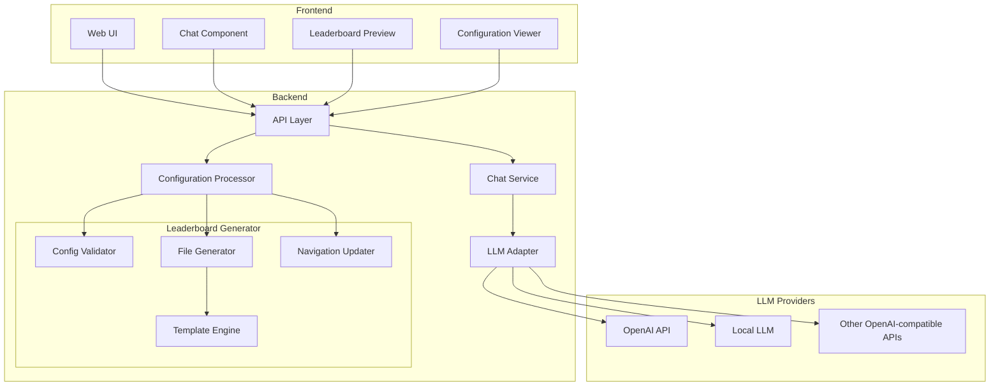

### Component Descriptions

#### Frontend Components

1. **Web UI**: A responsive web interface built with a modern framework (React)
2. **Chat Component**: Handles user-bot conversations with support for rich text and interactive elements
3. **Leaderboard Preview**: Real-time preview of the leaderboard being created
4. **Configuration Viewer**: Shows the current configuration state in JSON format

#### Backend Components

1. **API Layer**: RESTful API endpoints for chat, configuration, and leaderboard generation
2. **Chat Service**: Manages conversation state and history, processes messages
3. **LLM Adapter**: Provides a unified interface to multiple LLM providers
4. **Configuration Processor**: Transforms chat-extracted information into valid configurations
5. **Existing Leaderboard Generator Components**: Reused for validation, file generation, etc.

### Key Design Decisions

1. **Separation of Concerns**: Clear separation between chat interface, LLM integration, and leaderboard generation
2. **Stateful Chat Service**: Maintains conversation context to improve LLM performance
3. **Pluggable LLM Architecture**: Abstract interface for LLM providers
4. **Real-time Feedback**: Live preview of the leaderboard as it's being configured
5. **Progressive Enhancement**: Basic functionality works with text-only chat, enhanced with rich UI

## LLM Integration Strategy

To support multiple LLM providers through OpenAI-compatible endpoints, including local models, we'll implement an adapter pattern:

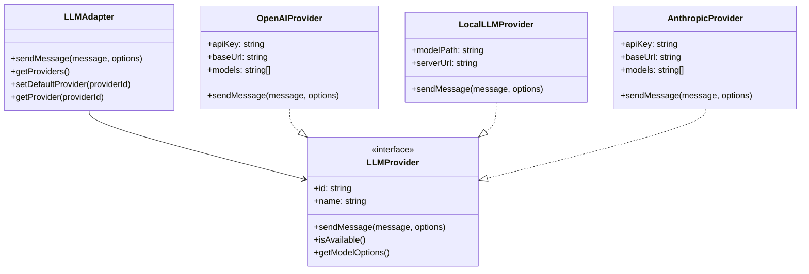

### Configuration System

```json
{
  "llm": {
    "defaultProvider": "openai",
    "providers": {
      "openai": {
        "type": "openai",
        "apiKey": "${OPENAI_API_KEY}",
        "baseUrl": "https://api.openai.com/v1",
        "defaultModel": "gpt-4",
        "models": ["gpt-4", "gpt-3.5-turbo"]
      },
      "localllm": {
        "type": "local",
        "baseUrl": "http://localhost:8000/v1",
        "defaultModel": "llama3",
        "models": ["llama3", "mistral"]
      },
      "anthropic": {
        "type": "anthropic",
        "apiKey": "${ANTHROPIC_API_KEY}",
        "baseUrl": "https://api.anthropic.com",
        "defaultModel": "claude-3-opus",
        "models": ["claude-3-opus", "claude-3-sonnet"]
      }
    },
    "fallbackOrder": ["openai", "localllm", "anthropic"]
  }
}
```

### Provider Registration System

The system will support dynamic provider registration:

```javascript
// Dynamic provider registration
class LLMAdapterRegistry {
  static providers = new Map();
  
  static register(type, providerClass) {
    this.providers.set(type, providerClass);
  }
  
  static create(type, config) {
    const ProviderClass = this.providers.get(type);
    if (!ProviderClass) {
      throw new Error(`Unknown provider type: ${type}`);
    }
    return new ProviderClass(config);
  }
}

// Register built-in providers
LLMAdapterRegistry.register('openai', OpenAIProvider);
LLMAdapterRegistry.register('local', LocalLLMProvider);
LLMAdapterRegistry.register('anthropic', AnthropicProvider);
```

### Message Format Standardization

To ensure consistent handling across providers, we'll standardize message formats:

```javascript
// Input message format
const message = {
  role: 'user', // 'user', 'assistant', or 'system'
  content: 'Create a leaderboard for quantum chemistry simulations',
  metadata: {
    timestamp: Date.now(),
    sessionId: 'session-123'
  }
};

// Output message format
const response = {
  role: 'assistant',
  content: 'I can help you create a quantum chemistry leaderboard...',
  metadata: {
    provider: 'openai',
    model: 'gpt-4',
    timestamp: Date.now(),
    usage: {
      promptTokens: 42,
      completionTokens: 128,
      totalTokens: 170
    }
  },
  // Extracted structured data (if any)
  extractedData: {
    leaderboardId: 'quantum-chemistry',
    title: 'Quantum Chemistry Simulations',
    // ...other configuration fields
  }
};
```

### Prompt Engineering and Templates

To ensure consistent results across different LLM providers, we'll implement a prompt template system:

```javascript
class PromptTemplateManager {
  static templates = {
    leaderboardCreation: `
      You are an assistant helping to create a leaderboard for the Quantum Advantage Framework.
      
      The leaderboard should follow this schema:
      {{schema}}
      
      Current configuration state:
      {{currentConfig}}
      
      User request: {{userMessage}}
      
      Respond conversationally but also extract structured configuration data.
    `,
    // Other templates...
  };
  
  static getPrompt(templateName, variables) {
    const template = this.templates[templateName];
    return template.replace(/\{\{(\w+)\}\}/g, (_, key) => variables[key] || '');
  }
}
```

### Error Handling and Fallback Strategy

```javascript
async function sendMessageWithFallback(message, options) {
  const { fallbackOrder } = options;
  let lastError = null;
  
  for (const providerId of fallbackOrder) {
    try {
      const provider = LLMAdapter.getProvider(providerId);
      if (await provider.isAvailable()) {
        return await provider.sendMessage(message, options);
      }
    } catch (error) {
      lastError = error;
      console.error(`Provider ${providerId} failed:`, error);
      // Continue to next provider
    }
  }
  
  throw new Error(`All providers failed. Last error: ${lastError?.message}`);
}
```

### Local Model Integration

For local models, we'll support two approaches:

1. **Direct Integration**: For models running locally with OpenAI-compatible API endpoints
2. **Container-based Deployment**: Bundle popular local models in the application container

## Conversation Flow and User Experience

The conversation flow is designed to guide users through the leaderboard creation process while adapting to different expertise levels.

### Conversation Stages

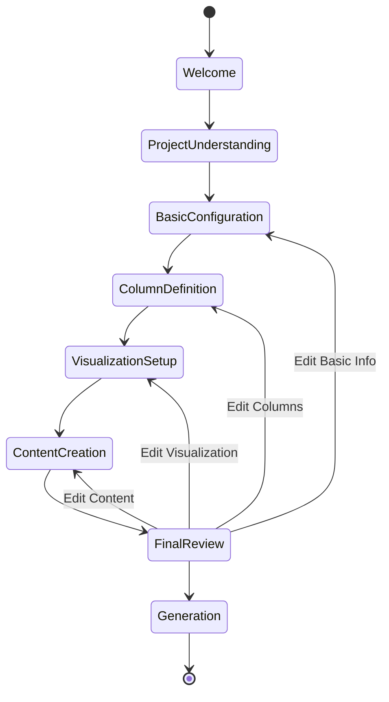

### Stage Descriptions

1. **Welcome Stage**: Greet the user and explain the purpose of the chat interface
2. **Project Understanding Stage**: Understand the purpose, domain, and target audience
3. **Basic Configuration Stage**: Create ID, title, descriptions, and navigation position
4. **Column Definition Stage**: Define standard and custom columns with properties
5. **Visualization Setup Stage**: Configure chart type, axes, and data point styling
6. **Content Creation Stage**: Create additional content sections and text
7. **Final Review Stage**: Show complete configuration, preview, and validation
8. **Generation Stage**: Create the leaderboard files and update navigation

### User Experience Principles

1. **Progressive Disclosure**: Start simple and gradually increase complexity
2. **Multi-Modal Input Handling**: Support both structured and unstructured inputs
3. **Contextual Assistance**: Provide examples and suggestions based on domain
4. **Error Recovery**: Gracefully handle misunderstandings and provide correction paths

### Conversation Patterns

1. **Guided Approach with Flexible Overrides**: Lead users through stages but allow jumping ahead
2. **Expert vs. Novice Paths**: Adapt guidance based on detected expertise level
3. **Configuration Extraction**: Extract structured data from natural language
4. **Real-time Feedback**: Provide immediate validation and preview updates

## Frontend Interface Components

### Layout Structure

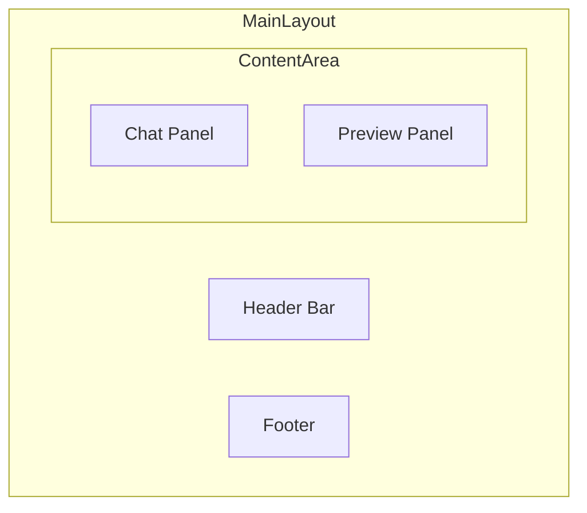

### Core Components

#### Header Bar

```
+---------------------------------------------------------------+
| Logo | Leaderboard Generator | Settings | Help | User Account |
+---------------------------------------------------------------+
```

#### Chat Panel

```
+-----------------------------------------------+
| Chat History                                  |
|                                               |
| +-------------------------------------------+ |
| | Assistant: Welcome to the Leaderboard...  | |
| +-------------------------------------------+ |
|                                               |
| +-------------------------------------------+ |
| | User: I want to create a quantum...       | |
| +-------------------------------------------+ |
|                                               |
| +-------------------------------------------+ |
| | Assistant: Great! Let's start by...       | |
| +-------------------------------------------+ |
|                                               |
| +-------------------------------------------+ |
| | Message Input                             | |
| | +---------------------------------------+ | |
| | | Type your message...                  | | |
| | +---------------------------------------+ | |
| | [Send]                                    | |
| +-------------------------------------------+ |
+-----------------------------------------------+
```

#### Preview Panel

```
+-----------------------------------------------+
| Preview Controls                              |
| [Refresh] [Full Screen] [View JSON]           |
+-----------------------------------------------+
| Leaderboard Preview                           |
|                                               |
| +-------------------------------------------+ |
| | Quantum Error Correction                  | |
| | =====================                     | |
| |                                           | |
| | [Table View]                              | |
| | +-----+------+--------+--------+--------+ | |
| | |Rank |Code  |Error   |Qubits  |Inst.   | | |
| | +-----+------+--------+--------+--------+ | |
| | |1    |Surface|0.1%   |49      |IBM     | | |
| | +-----+------+--------+--------+--------+ | |
| |                                           | |
| | [Visualization]                           | |
| | (Scatter plot of error rates vs qubits)   | |
| |                                           | |
| +-------------------------------------------+ |
+-----------------------------------------------+
```

#### Configuration Inspector

```
+-----------------------------------------------+
| Configuration                                 |
| +-------------------------------------------+ |
| | {                                         | |
| |   "id": "quantum-error-correction",       | |
| |   "title": "Quantum Error Correction",    | |
| |   "columns": [                            | |
| |     {                                     | |
| |       "id": "rank",                       | |
| |       "name": "Rank",                     | |
| |       ...                                 | |
| |     }                                     | |
| |   ],                                      | |
| |   ...                                     | |
| | }                                         | |
| +-------------------------------------------+ |
| [Copy] [Download] [Edit]                     |
+-----------------------------------------------+
```

### Interactive Components

1. **Suggestion Chips**: Clickable suggestion chips for common responses
2. **Structured Input Forms**: Contextual forms for complex data entry
3. **Configuration Navigator**: Overview of configuration sections with status indicators

### Responsive Design

The interface will adapt to different screen sizes:
- Desktop: Side-by-side chat and preview panels
- Tablet: Tabbed interface with chat and preview tabs
- Mobile: Stacked layout with collapsible sections

### Accessibility Considerations

- Keyboard navigation support
- Screen reader compatibility
- High contrast mode
- Text scaling support
- Focus indicators
- Alternative text for visualizations

## Backend API and Services

### API Endpoints

#### Chat API

| Endpoint | Method | Description | Request Body | Response |
|----------|--------|-------------|-------------|----------|
| `/api/chat/session` | POST | Create a new chat session | `{ sessionName?: string }` | `{ sessionId: string, createdAt: timestamp }` |
| `/api/chat/session/:sessionId` | GET | Get session details | - | `{ sessionId: string, messages: Message[], config: LeaderboardConfig }` |
| `/api/chat/session/:sessionId` | DELETE | Delete a session | - | `{ success: boolean }` |
| `/api/chat/message` | POST | Send a message | `{ sessionId: string, message: string }` | `{ messageId: string, response: Message, updatedConfig: LeaderboardConfig }` |
| `/api/chat/sessions` | GET | List all sessions | - | `{ sessions: Session[] }` |

#### Configuration API

| Endpoint | Method | Description | Request Body | Response |
|----------|--------|-------------|-------------|----------|
| `/api/config/:sessionId` | GET | Get current configuration | - | `{ config: LeaderboardConfig }` |
| `/api/config/:sessionId` | PUT | Update configuration | `{ config: LeaderboardConfig }` | `{ config: LeaderboardConfig, validation: ValidationResult }` |
| `/api/config/:sessionId/validate` | POST | Validate configuration | `{ config: LeaderboardConfig }` | `{ valid: boolean, errors: ValidationError[] }` |
| `/api/config/import` | POST | Import configuration | `{ config: LeaderboardConfig }` | `{ sessionId: string, config: LeaderboardConfig }` |
| `/api/config/:sessionId/export` | GET | Export configuration | - | `{ config: LeaderboardConfig }` (as downloadable file) |

#### Leaderboard Generation API

| Endpoint | Method | Description | Request Body | Response |
|----------|--------|-------------|-------------|----------|
| `/api/generate/:sessionId` | POST | Generate leaderboard | `{ updateNavigation: boolean }` | `{ success: boolean, path: string, logs: string[] }` |
| `/api/preview/:sessionId` | GET | Get HTML preview | - | HTML content |
| `/api/preview/:sessionId/visualization` | GET | Get visualization preview | - | SVG/Canvas data |

#### LLM Provider API

| Endpoint | Method | Description | Request Body | Response |
|----------|--------|-------------|-------------|----------|
| `/api/llm/providers` | GET | List available providers | - | `{ providers: Provider[] }` |
| `/api/llm/provider/:providerId` | GET | Get provider details | - | `{ provider: Provider, models: Model[] }` |
| `/api/llm/provider/:providerId` | PUT | Update provider config | `{ config: ProviderConfig }` | `{ success: boolean, provider: Provider }` |
| `/api/llm/test/:providerId` | POST | Test provider connection | `{ prompt: string }` | `{ success: boolean, response: string }` |

### Service Layer

#### ChatService

```typescript
interface ChatService {
  createSession(options?: { name?: string }): Promise<Session>;
  getSession(sessionId: string): Promise<Session>;
  listSessions(): Promise<Session[]>;
  deleteSession(sessionId: string): Promise<boolean>;
  sendMessage(sessionId: string, message: string): Promise<{
    messageId: string;
    response: Message;
    updatedConfig: LeaderboardConfig;
  }>;
}
```

#### ConfigurationService

```typescript
interface ConfigurationService {
  getConfiguration(sessionId: string): Promise<LeaderboardConfig>;
  updateConfiguration(sessionId: string, config: LeaderboardConfig): Promise<{
    config: LeaderboardConfig;
    validation: ValidationResult;
  }>;
  validateConfiguration(config: LeaderboardConfig): Promise<ValidationResult>;
  importConfiguration(config: LeaderboardConfig): Promise<{
    sessionId: string;
    config: LeaderboardConfig;
  }>;
  exportConfiguration(sessionId: string): Promise<LeaderboardConfig>;
}
```

#### LeaderboardGeneratorService

```typescript
interface LeaderboardGeneratorService {
  generateLeaderboard(sessionId: string, options: {
    updateNavigation: boolean;
  }): Promise<{
    success: boolean;
    path: string;
    logs: string[];
  }>;
  generatePreview(sessionId: string): Promise<string>; // HTML content
  generateVisualizationPreview(sessionId: string): Promise<string>; // SVG/Canvas data
}
```

#### LLMService

```typescript
interface LLMService {
  getProviders(): Promise<Provider[]>;
  getProvider(providerId: string): Promise<{
    provider: Provider;
    models: Model[];
  }>;
  updateProviderConfig(providerId: string, config: ProviderConfig): Promise<{
    success: boolean;
    provider: Provider;
  }>;
  testProvider(providerId: string, prompt: string): Promise<{
    success: boolean;
    response: string;
  }>;
  processMessage(providerId: string, messages: Message[], options?: {
    extractConfig?: boolean;
    model?: string;
    temperature?: number;
  }): Promise<{
    response: Message;
    extractedConfig?: Partial<LeaderboardConfig>;
  }>;
}
```

### Data Models

#### Session

```typescript
interface Session {
  id: string;
  name?: string;
  createdAt: Date;
  updatedAt: Date;
  messages: Message[];
  config: LeaderboardConfig;
  metadata: {
    currentStage: string;
    completedStages: string[];
    activeProvider: string;
  };
}
```

#### Message

```typescript
interface Message {
  id: string;
  role: 'user' | 'assistant' | 'system';
  content: string;
  timestamp: Date;
  metadata?: {
    extractedConfig?: Partial<LeaderboardConfig>;
    provider?: string;
    model?: string;
    tokens?: {
      prompt: number;
      completion: number;
      total: number;
    };
  };
}
```

### Integration with Existing Components

The chat interface will integrate with existing leaderboard-generator components through adapter classes:

```typescript
// Using the existing validator with a Promise-based interface
class ConfigValidatorAdapter {
  async validate(config: LeaderboardConfig): Promise<ValidationResult> {
    try {
      // Call the existing validator
      const validatedConfig = await validateConfigFile(config);
      return {
        valid: true,
        config: validatedConfig,
        errors: []
      };
    } catch (error) {
      return {
        valid: false,
        config,
        errors: this.parseValidationErrors(error)
      };
    }
  }
}
```

## Data Flow Diagrams

### High-Level Data Flow

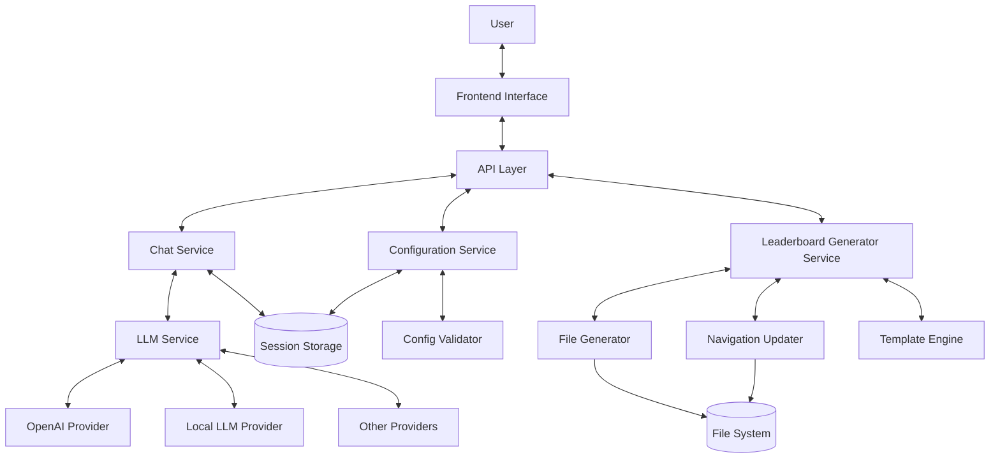

### Message Flow Sequence

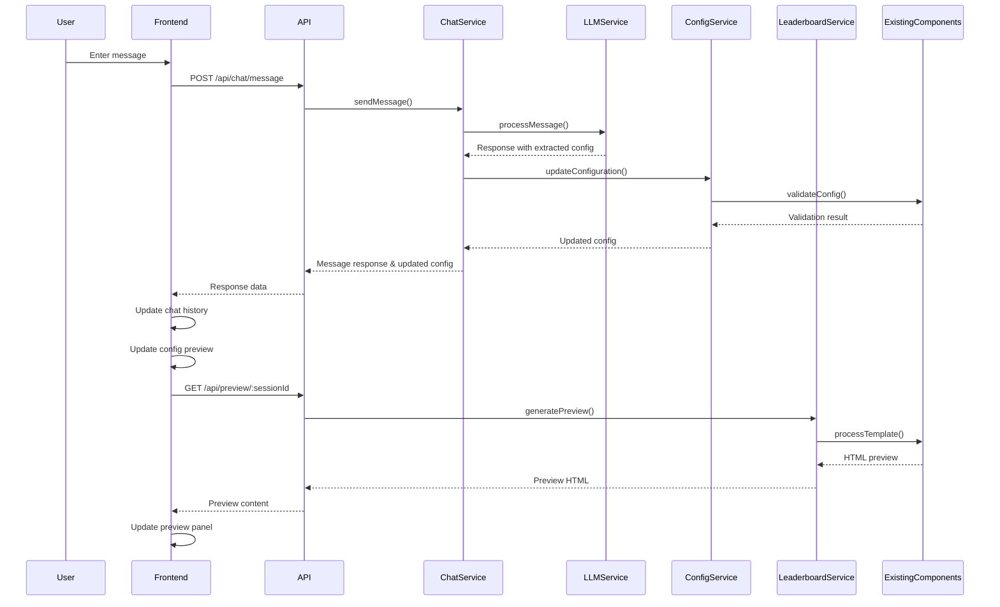

### Configuration Data Flow

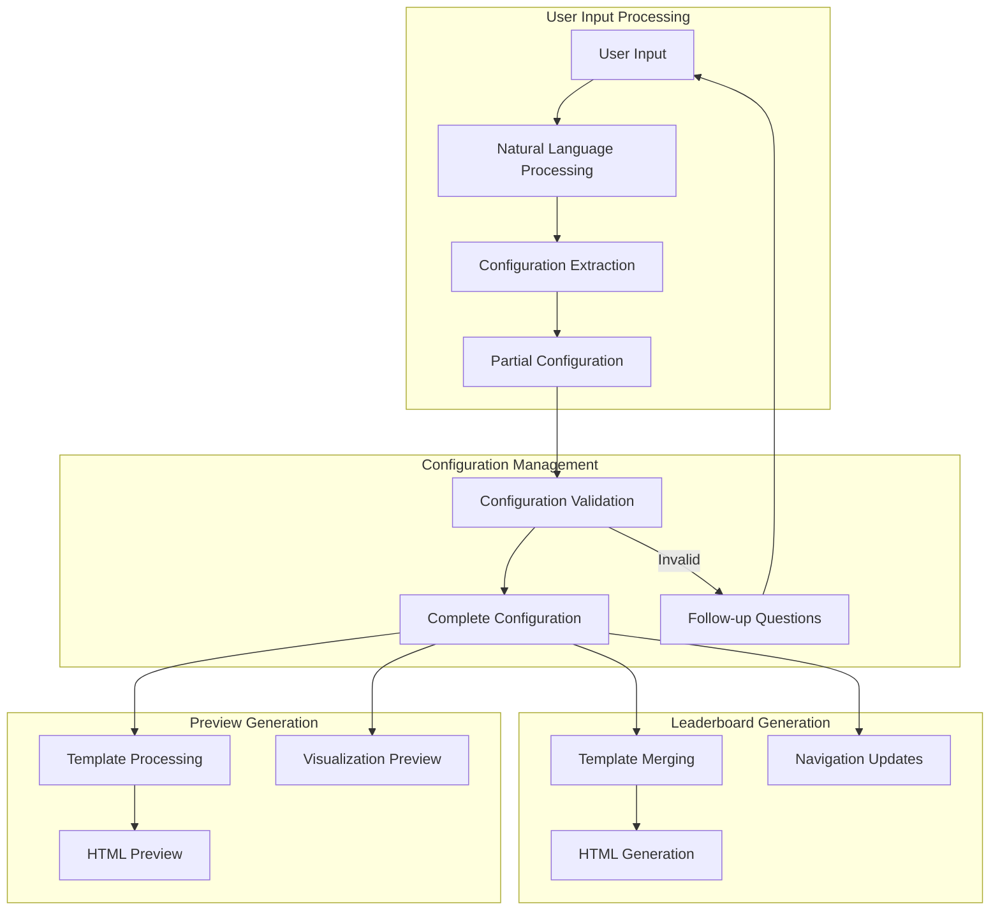

## Deployment Options

Based on the requirement to support both standalone operation and flexibility, we recommend a hybrid approach with multiple deployment options:

### Docker Container Deployment

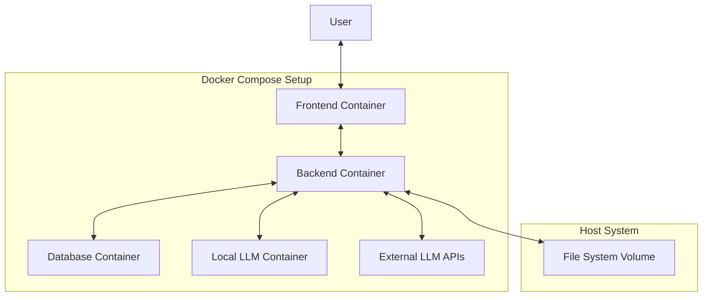

#### Implementation Details

```yaml
# docker-compose.yml
version: '3.8'

services:
  frontend:
    build: ./frontend
    ports:
      - "3000:80"
    depends_on:
      - backend
    environment:
      - API_URL=http://backend:4000

  backend:
    build: ./backend
    ports:
      - "4000:4000"
    depends_on:
      - database
      - local-llm
    environment:
      - DATABASE_URL=mongodb://database:27017/leaderboard
      - LOCAL_LLM_URL=http://local-llm:8000
      - OPENAI_API_KEY=${OPENAI_API_KEY}
    volumes:
      - ./leaderboards:/app/leaderboards

  database:
    image: mongo:latest
    ports:
      - "27017:27017"
    volumes:
      - mongo-data:/data/db

  local-llm:
    image: ollama/ollama:latest
    ports:
      - "8000:8000"
    volumes:
      - ollama-models:/root/.ollama
    command: run llama3

volumes:
  mongo-data:
  ollama-models:
```

### Standalone Electron Application

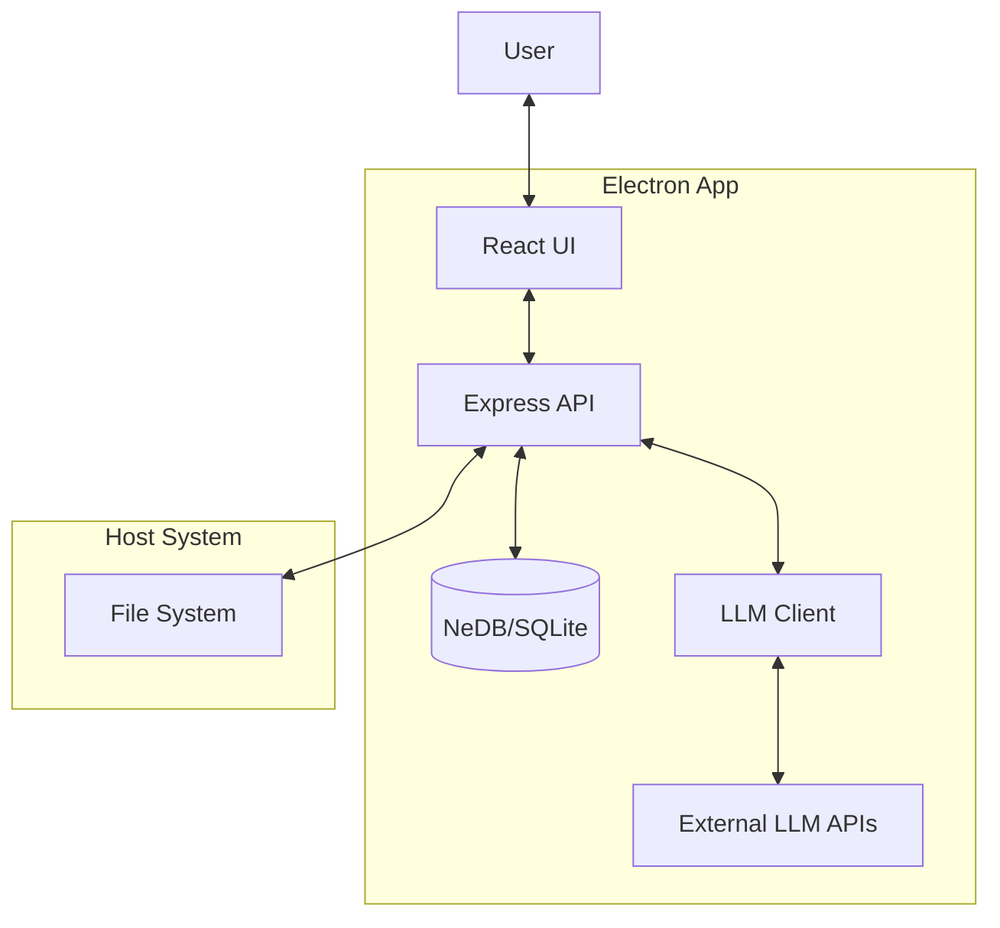

### Web Application with Optional Local Backend

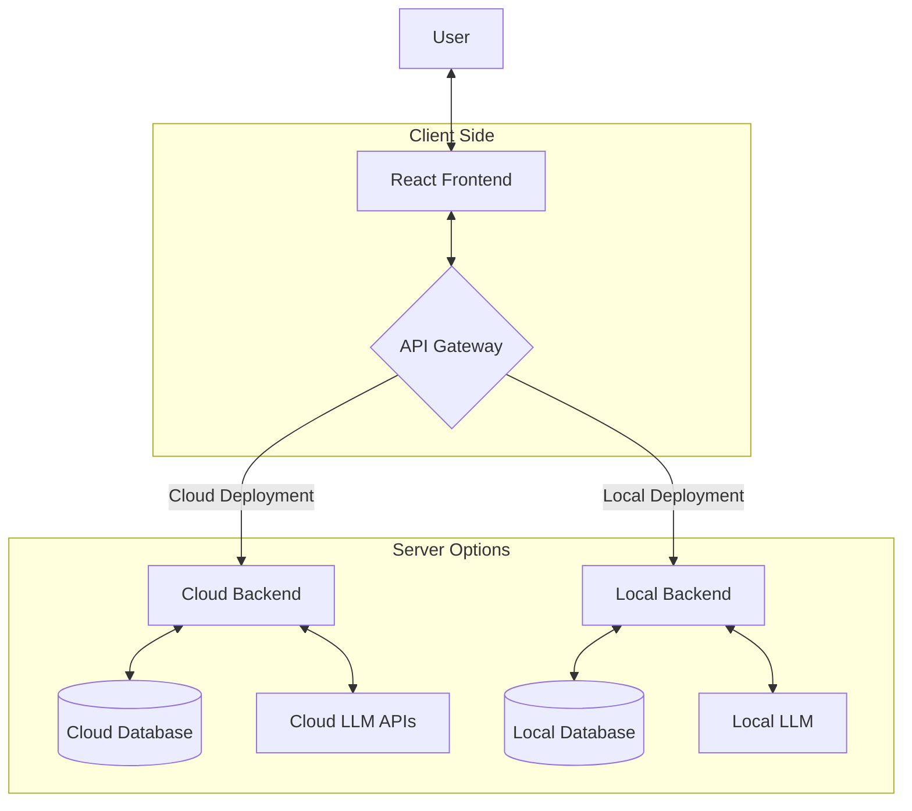

### Serverless Deployment (Cloud-Only)

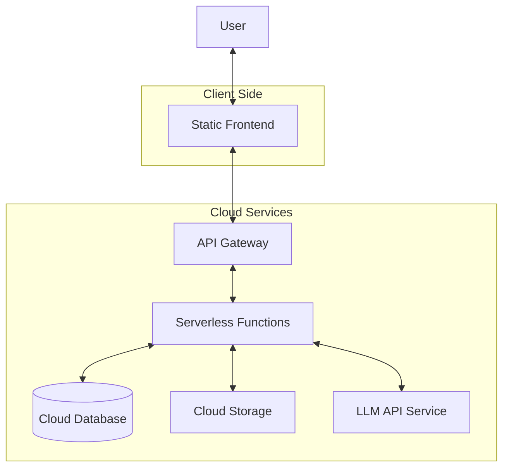

### Hybrid Deployment Recommendation

We recommend a hybrid approach that combines elements of the Docker container and web application options:

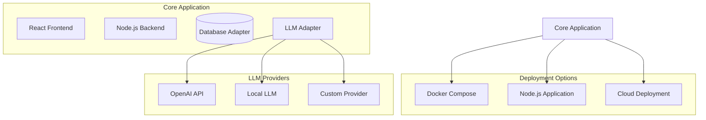

## Development Phases and Milestones

Let's outline a comprehensive development plan with clear phases, milestones, and timelines for implementing the chat interface for the leaderboard-generator tool.

### Phase 1: Foundation and Core Components (4 weeks)

#### Milestone 1.1: Project Setup and Architecture (Week 1)
- **Tasks:**
  - Set up project repository and structure
  - Configure development environment
  - Implement basic frontend and backend skeletons
  - Set up CI/CD pipeline
- **Deliverables:**
  - Project repository with initial structure
  - Development environment documentation
  - Architecture documentation
  - Basic CI/CD configuration

#### Milestone 1.2: Backend Core Services (Weeks 2-3)
- **Tasks:**
  - Implement session management service
  - Create configuration service with validation
  - Develop basic LLM adapter interface
  - Integrate with existing leaderboard-generator components
- **Deliverables:**
  - Working backend API with core endpoints
  - Integration tests for existing components
  - LLM adapter with at least one provider implementation
  - API documentation

#### Milestone 1.3: Frontend Foundation (Weeks 3-4)
- **Tasks:**
  - Implement responsive layout structure
  - Create chat interface components
  - Develop configuration viewer/editor
  - Set up state management
- **Deliverables:**
  - Working frontend with basic UI components
  - Chat interface with message history
  - Configuration viewer and editor
  - End-to-end tests for basic workflows

### Phase 2: LLM Integration and Conversation Flow (4 weeks)

#### Milestone 2.1: LLM Provider Implementation (Weeks 1-2)
- **Tasks:**
  - Implement OpenAI provider
  - Develop local LLM provider
  - Create provider management interface
  - Implement caching and optimization
- **Deliverables:**
  - Multiple working LLM providers
  - Provider switching capability
  - Performance optimization metrics
  - Provider testing suite

#### Milestone 2.2: Conversation Flow Development (Weeks 2-3)
- **Tasks:**
  - Implement conversation stages
  - Develop prompt templates for each stage
  - Create configuration extraction logic
  - Build context management system
- **Deliverables:**
  - Working conversation flow through all stages
  - Prompt templates for different leaderboard types
  - Configuration extraction from natural language
  - Context management with history pruning

#### Milestone 2.3: Error Handling and Recovery (Week 4)
- **Tasks:**
  - Implement validation feedback
  - Develop provider fallback strategies
  - Create error recovery flows
  - Build user feedback mechanisms
- **Deliverables:**
  - Robust error handling system
  - Provider fallback with seamless recovery
  - User-friendly error messages
  - Recovery flow tests

### Phase 3: Preview and Generation Integration (3 weeks)

#### Milestone 3.1: Preview Generation (Weeks 1-2)
- **Tasks:**
  - Implement HTML preview generation
  - Create visualization preview
  - Develop real-time preview updates
  - Build preview controls
- **Deliverables:**
  - Working HTML preview system
  - Interactive visualization previews
  - Real-time preview updates during conversation
  - Preview customization options

#### Milestone 3.2: Leaderboard Generation (Weeks 2-3)
- **Tasks:**
  - Integrate with file generator
  - Implement navigation updates
  - Create generation options interface
  - Develop success/failure handling
- **Deliverables:**
  - Complete leaderboard generation flow
  - Navigation update integration
  - Generation options UI
  - Generation result handling

### Phase 4: User Experience Enhancement (3 weeks)

#### Milestone 4.1: Advanced UI Components (Weeks 1-2)
- **Tasks:**
  - Implement suggestion chips
  - Create structured input forms
  - Develop configuration navigator
  - Build advanced message rendering
- **Deliverables:**
  - Interactive suggestion chips
  - Context-aware structured input forms
  - Navigation between configuration sections
  - Rich message rendering with formatting

#### Milestone 4.2: Accessibility and Responsiveness (Week 2)
- **Tasks:**
  - Implement keyboard navigation
  - Add screen reader support
  - Ensure responsive layouts
  - Test across devices
- **Deliverables:**
  - WCAG AA compliance
  - Full keyboard navigation
  - Responsive design across devices
  - Accessibility test reports

#### Milestone 4.3: Performance Optimization (Week 3)
- **Tasks:**
  - Optimize frontend rendering
  - Improve API response times
  - Implement lazy loading
  - Add caching strategies
- **Deliverables:**
  - Performance metrics and improvements
  - Optimized API response times
  - Efficient resource loading
  - Caching implementation

### Phase 5: Deployment and Documentation (2 weeks)

#### Milestone 5.1: Deployment Configuration (Week 1)
- **Tasks:**
  - Create Docker configuration
  - Implement standalone application packaging
  - Develop cloud deployment scripts
  - Build configuration system
- **Deliverables:**
  - Docker Compose setup
  - Standalone application package
  - Cloud deployment documentation
  - Configuration guide

#### Milestone 5.2: Documentation and Training (Week 2)
- **Tasks:**
  - Write user documentation
  - Create developer guides
  - Develop tutorial content
  - Record demo videos
- **Deliverables:**
  - Comprehensive user documentation
  - Developer API documentation
  - Tutorial guides for common tasks
  - Demo videos for key features

### Phase 6: Testing and Refinement (2 weeks)

#### Milestone 6.1: Comprehensive Testing (Week 1)
- **Tasks:**
  - Conduct user acceptance testing
  - Perform security testing
  - Run performance benchmarks
  - Test across deployment options
- **Deliverables:**
  - User acceptance test results
  - Security assessment report
  - Performance benchmark results
  - Cross-deployment test results

#### Milestone 6.2: Refinement and Launch (Week 2)
- **Tasks:**
  - Address feedback from testing
  - Fix identified issues
  - Optimize based on benchmarks
  - Prepare for launch
- **Deliverables:**
  - Refined application based on feedback
  - Fixed issues and bugs
  - Optimized performance
  - Launch-ready application

### Development Timeline Overview

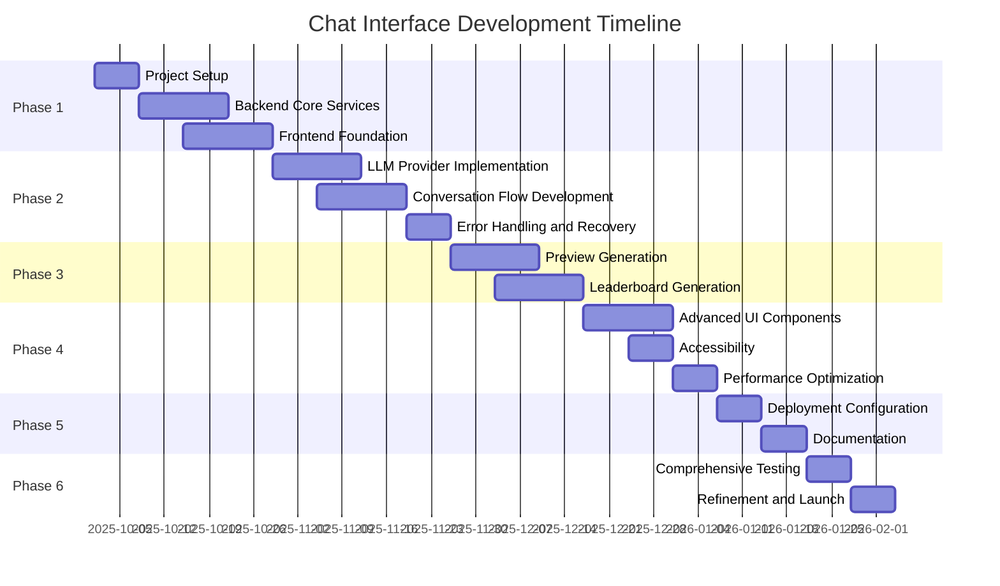

### Risk Management

| Risk | Impact | Probability | Mitigation Strategy |
|------|--------|------------|---------------------|
| LLM API changes | High | Medium | Design adapter layer with version handling; monitor API announcements |
| Integration issues with existing components | Medium | High | Early integration testing; maintain compatibility layer |
| Performance issues with local LLM | High | Medium | Implement fallback to cloud providers; optimize prompts |
| User experience complexity | Medium | Medium | Iterative user testing; progressive disclosure design |
| Deployment environment variations | Medium | High | Containerization; comprehensive environment documentation |
| Security vulnerabilities | High | Low | Regular security audits; input sanitization; proper authentication |

### Success Criteria

1. **Functional Criteria**
   - Successfully create complete leaderboards through conversation
   - Support all configuration options available in the existing tool
   - Generate valid HTML and update navigation correctly
   - Work with multiple LLM providers including local options

2. **User Experience Criteria**
   - Reduce leaderboard creation time by 50% compared to manual configuration
   - Achieve 90% success rate for first-time users
   - Receive positive feedback on conversation flow and guidance
   - Support users of varying technical expertise levels

3. **Technical Criteria**
   - Maintain 99% uptime for deployed instances
   - Process chat messages within 3 seconds (excluding LLM response time)
   - Generate previews within 1 second
   - Support all major browsers and devices

4. **Deployment Criteria**
   - Successfully deploy in all target environments
   - Provide clear documentation for each deployment option
   - Enable smooth updates without data loss
   - Support configuration persistence across restarts